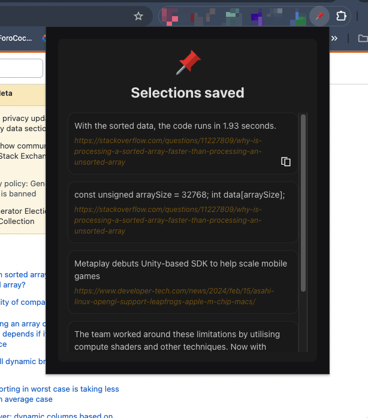

# Selection Saver Chrome Extension

## Overview

The Selection Saver Chrome extension allows users to save selected text from web pages.

#### Popup Interface

## Usage

Once installed, the extension operates automatically whenever a web page is loaded. Users can perform the following actions:

1. **Select Text**: Click and drag to select text on a web page.
2. **Save Selection**: When text is selected, a save button appears nearby. Clicking this button saves the selected text.
3. **View Saved Selections**: Saved selections are accessible via the extension's interface or by visiting the designated URL.

## Installation

[Chrome Extension build and install](./chrome-extension/README.md)

[API build and install](./api/README.md)

## Support and Feedback

For support or feedback regarding the Selection Saver Chrome extension, users can contact me or submit an issue on the GitHub repository.

## License

[MIT](./LICENSE)
