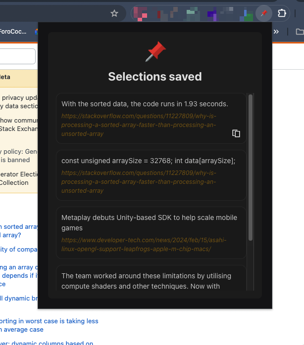

# Selection Saver Chrome Extension

## Overview

The Selection Saver Chrome extension allows users to save selected text from web pages. This documentation provides an overview of the extension's functionality, architecture, and usage.

#### Save Button


#### Popup Interface



## Functionality

The Chrome extension operates by injecting JavaScript code into web pages. It listens for user selections, displays a save button near the selected text, and upon clicking the button, saves the selection to a remote database.

### Key Features

- Detects user selections on web pages.
- Displays a save button near the selected text.
- Saves the selected text along with the URL and timestamp to a remote database.

## Architecture

The architecture of the extension consists of several components:

1. **Content Script**: Injected JavaScript code that interacts with the web page DOM and listens for user selections.
   
2. **Popup**: Quickly displays all saved selections with url

3. **Chrome Storage**: Stores user tokens and other relevant data.

4. **Remote Database**: Stores saved selections associated with user tokens.

## Installation

To install the Selection Saver Chrome extension:

1. Download the extension package from the Chrome Web Store or 

2. Clone GitHub repository.
   
3. Build the extension
```sh
npm install
```
```sh
npm run build
```
4. Open the Chrome browser and navigate to the Extensions page (`chrome://extensions/`).
5. Enable Developer mode.
6. Click on "Load unpacked" and select the dist folder.
7. The extension should now be installed and active in the browser.

## Usage

Once installed, the extension operates automatically whenever a web page is loaded. Users can perform the following actions:

1. **Select Text**: Click and drag to select text on a web page.
2. **Save Selection**: When text is selected, a save button appears nearby. Clicking this button saves the selected text.
3. **View Saved Selections**: Saved selections are accessible via the extension's interface or by visiting the designated URL.

## Troubleshooting

If the extension does not function as expected, users can try the following troubleshooting steps:

- Ensure that the extension is enabled and active in the browser.
- Check for any conflicts with other installed extensions.
- Verify that the browser is up to date.


